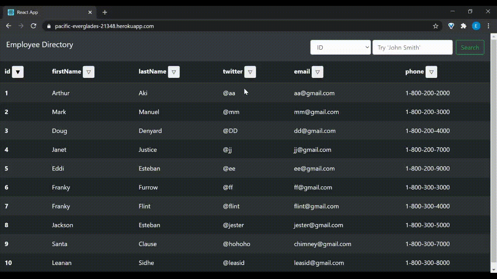

   

# Employee Directory

1. [Description](#toc-desc)

2. [Installation](#toc-install)

3. [Usage](#toc-usage)

4. [License](#toc-license)

5. [Contributing](#toc-contrib)

6. [Tests](#toc-tests)

7. [Questions](#toc-contact)

<a id='toc-desc'></a>
## Description
This app displays data from the included employees.JSON file. It can be sorted ascending or descending in character value, and can be filtered on each field.

<a id='toc-install'></a>
## Installation
Clone to your local machine and cd into the repo.
```sh
npm install
```

<a id='toc-usage'></a>
## Usage
```sh
npm run startdev
```
Deployed site is linked at https://pacific-everglades-21348.herokuapp.com/. 


<a id='toc-license'></a>
## License
[MIT](LICENSE)

<a id='toc-contrib'></a>
## Contributing
Submit a pull request and the repository owner will review your changes.

<a id='toc-tests'></a>
## Tests
No tests.

<a id='toc-contact'></a>
## Questions
<a href="https://github.com/EddiEsteban" rel="some text"></a>

Please direct any questions, concerns, and compliments to [EddiEsteban](https://github.com/EddiEsteban)
 
